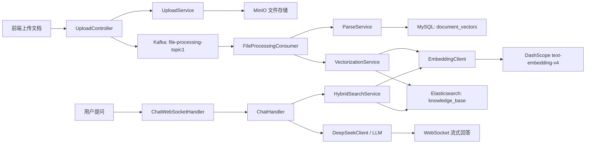

# SmartAsk 项目介绍文档

## 1. 项目定位

SmartAsk（派聪明）是一个企业级 AI 知识库管理系统，核心能力是把企业或个人上传的文档转成可检索的知识资产，并通过 RAG（Retrieval-Augmented Generation，检索增强生成）让用户用自然语言提问、获得基于私有文档的 AI 回答。

它不是单纯的聊天应用，而是一套完整的“文档入库 -> 文档理解 -> 权限过滤 -> 混合检索 -> AI 生成”的知识库系统。系统同时关注三类问题：

- 文档如何稳定上传、解析、切片和向量化。
- 用户如何只检索到自己有权限访问的知识。
- AI 如何基于检索结果生成可追溯、实时返回的回答。

## 2. 一句话业务链路

用户上传文档后，前端按分片上传到后端，后端合并文件并存入 MinIO，然后发送 Kafka 任务异步解析文档；解析出的文本块写入 MySQL，并调用 DashScope Embedding 生成 2048 维向量后写入 Elasticsearch；用户聊天时，系统先按权限做混合检索，再把检索结果作为上下文交给大模型生成回答，并通过 WebSocket 流式推送给前端。



## 3. 技术栈

### 后端

- Java 17
- Spring Boot 3.4.2
- Spring MVC + Spring Security + JWT
- Spring Data JPA
- Spring Kafka
- Spring WebSocket
- WebFlux WebClient
- MySQL 8.0
- Redis
- Elasticsearch 8.10.x，索引使用 IK 中文分词
- MinIO
- Apache Tika 文档解析
- HanLP 中文分词
- Embedding 使用 DashScope 兼容模式 API：`text-embedding-v4`
- AI 生成由 `DeepSeekClient` 读取 `deepseek.api.*` 配置后调用对应大模型服务

### 前端

- Vue 3.5.x
- TypeScript
- Vite 6
- Pinia
- Naive UI
- Vue Router
- `@vueuse/core` 的 `useWebSocket`
- pnpm workspace monorepo

## 4. 仓库结构

```text
smartask/
├─ src/main/java/com/lcmob/smartask/
│  ├─ controller/       # REST API 入口
│  ├─ service/          # 业务逻辑：上传、解析、向量化、检索、聊天、权限
│  ├─ consumer/         # Kafka 消费者
│  ├─ client/           # 外部 AI 服务客户端
│  ├─ config/           # Security、Kafka、ES、MinIO、WebSocket 等配置
│  ├─ model/            # JPA 实体
│  ├─ entity/           # ES 文档、搜索请求/响应、聊天消息等领域对象
│  ├─ repository/       # JPA Repository 与 Redis 封装
│  ├─ handler/          # WebSocket Handler
│  └─ utils/            # JWT、密码、日志等工具
├─ src/main/resources/
│  ├─ application.yml
│  ├─ application-dev.yml
│  └─ es-mappings/knowledge_base.json
├─ frontend/
│  ├─ src/views/        # chat、knowledge-base、org-tag、user 等页面
│  ├─ src/store/        # auth、chat、knowledge-base 等 Pinia store
│  ├─ src/service/      # API 请求封装
│  └─ packages/         # workspace 公共包
└─ docs/
   ├─ docker-compose.yaml
   ├─ docker-compose.local-middleware.yml
   └─ databases/ddl.sql
```

## 5. 核心模块介绍

### 5.1 用户与认证

入口主要在 `UserController`、`AuthController`、`AuthService`、`JwtAuthenticationFilter` 和 `SecurityConfig`。

- 登录注册接口位于 `/api/v1/users/login`、`/api/v1/users/register`。
- 登录成功后返回 JWT，后续请求通过 `Authorization` 头携带。
- `JwtAuthenticationFilter` 负责解析 Token 并把 `userId`、`role` 等信息放入请求上下文。
- `TokenCacheService` 和 Redis 用于处理登出、Token 缓存或失效控制。
- 管理员接口集中在 `/api/v1/admin/**`，由 Spring Security 限制为 `ADMIN` 角色。

### 5.2 多租户与组织标签

组织标签是 SmartAsk 的权限边界。核心类包括 `OrgTagService`、`OrgTagCacheService`、`OrgTagAuthorizationFilter`、`AdminOrgTagController` 和 `UserProfileService`。

系统通过 `organization_tags` 表保存组织标签及父子层级。文档记录中保存 `userId`、`orgTag`、`isPublic`，检索时用户可见范围为：

- 自己上传的文档。
- 公开文档。
- 自己所属组织标签下的文档。

`OrgTagAuthorizationFilter` 会在请求进入 Controller 前做资源级权限校验，避免用户绕过前端直接访问不属于自己的文档。

### 5.3 文件上传与断点续传

核心入口是 `UploadController` 和 `UploadService`，前端状态由 `frontend/src/store/modules/knowledge-base/index.ts` 管理。

上传流程如下：

1. 前端计算文件 MD5。
2. 前端按固定分片大小切片，调用 `/api/v1/upload/chunk`。
3. 后端在第一个分片校验文件类型。
4. 分片临时存入 MinIO，并记录已上传分片。
5. 所有分片完成后调用 `/api/v1/upload/merge`。
6. 后端合并文件，生成永久对象路径。
7. 后端向 Kafka 发送 `FileProcessingTask`，触发后续解析和向量化。

这个设计的好处是大文件上传不阻塞主请求，失败后可以查询 `/api/v1/upload/status` 获取已上传分片并继续上传。

### 5.4 文档解析与文本分块

核心类是 `FileProcessingConsumer` 和 `ParseService`。

Kafka 消费者监听 `file-processing-topic1`，拿到文件路径后下载文件流，调用 `ParseService.parseAndSave(...)`。解析层使用 Apache Tika 自动识别 PDF、Word、Excel、PPT、TXT 等文档格式，并采用流式处理，减少大文件导致 OOM 的风险。

分块策略是“父文档-子切片”：

- 父块默认约 1MB，用于保留较大上下文。
- 子切片默认 512 字符，用于更精确的向量检索。
- 先按段落切，再按句子切，超长句子再结合 HanLP 分词处理。
- 分块结果先写入 MySQL 的 `document_vectors` 表。

### 5.5 向量化与索引入库

核心类是 `VectorizationService`、`EmbeddingClient` 和 `ElasticsearchService`。

`VectorizationService` 会读取某个文件的文本块，批量调用 `EmbeddingClient.embed(...)` 生成向量，然后构造 `EsDocument` 批量写入 Elasticsearch 的 `knowledge_base` 索引。

当前开发配置中：

- Embedding API：`https://dashscope.aliyuncs.com/compatible-mode/v1`
- Embedding 模型：`text-embedding-v4`
- 向量维度：2048
- 批次大小：10

Elasticsearch 映射位于 `src/main/resources/es-mappings/knowledge_base.json`，核心字段包括：

- `textContent`：文本内容，使用 IK 分词，支持 BM25 检索。
- `vector`：2048 维 dense_vector，支持 KNN。
- `fileMd5`、`chunkId`：定位文档和文本块。
- `userId`、`orgTag`、`isPublic`：权限过滤字段。

### 5.6 混合检索

核心类是 `HybridSearchService`，HTTP 入口是 `SearchController` 的 `/api/v1/search/hybrid`。

检索策略分两段：

1. 对用户问题生成向量，用 KNN 扩大召回，召回窗口为 `topK * 30`。
2. 使用 BM25 对召回结果进行 rescore，文本匹配权重更高。

关键权重：

- KNN query weight：0.2
- BM25 rescore query weight：1.0

如果 Embedding 调用失败，服务会降级为纯文本 BM25 检索。带权限的检索方法是 `searchWithPermission(...)`，它会结合用户组织标签、文档归属和公开状态过滤结果。

### 5.7 AI 问答与 WebSocket 流式返回

核心类是 `ChatWebSocketHandler`、`ChatHandler` 和 `DeepSeekClient`。

前端通过 `frontend/src/store/modules/chat/index.ts` 创建 WebSocket 连接：

```text
/proxy-ws/chat/{token}
```

后端 WebSocket 真实入口为：

```text
ws://localhost:8081/chat/{jwtToken}
```

聊天处理链路：

1. `ChatWebSocketHandler` 从路径中提取 JWT 并建立连接。
2. 用户消息进入 `ChatHandler.processMessage(...)`。
3. `ChatHandler` 调用 `HybridSearchService.searchWithPermission(...)` 检索相关文档片段。
4. 检索结果被拼成上下文。
5. `DeepSeekClient.streamResponse(...)` 根据 `deepseek.api.*` 配置调用大模型流式生成回答。
6. 每个 chunk 通过 WebSocket 推给前端。
7. 对话历史写入 Redis 和 MySQL。

## 6. 数据模型

主要表结构位于 `docs/databases/ddl.sql`。

| 表名 | 作用 |
| --- | --- |
| `users` | 用户账号、角色、组织标签、主组织 |
| `organization_tags` | 组织标签及父子层级 |
| `file_upload` | 文件上传记录，包含 MD5、文件名、状态、用户、组织、公开状态 |
| `chunk_info` | 分片上传记录 |
| `document_vectors` | 文本块内容及权限字段，作为向量化前后的核心数据 |

Elasticsearch 的 `knowledge_base` 索引负责真正的检索召回，MySQL 负责业务状态、权限数据和可恢复记录。

## 7. API 概览

| 能力 | 路径 |
| --- | --- |
| 注册 | `POST /api/v1/users/register` |
| 登录 | `POST /api/v1/users/login` |
| 当前用户 | `GET /api/v1/users/me` |
| 上传分片 | `POST /api/v1/upload/chunk` |
| 上传状态 | `GET /api/v1/upload/status` |
| 合并文件 | `POST /api/v1/upload/merge` |
| 支持文件类型 | `GET /api/v1/upload/supported-types` |
| 可访问文档 | `GET /api/v1/documents/accessible` |
| 我的上传 | `GET /api/v1/documents/uploads` |
| 下载文档 | `GET /api/v1/documents/download` |
| 预览文档 | `GET /api/v1/documents/preview` |
| 混合搜索 | `GET /api/v1/search/hybrid` |
| WebSocket 聊天 | `ws://localhost:8081/chat/{jwtToken}` |
| 用户管理 | `/api/v1/admin/users/**` |
| 组织标签管理 | `/api/v1/admin/org-tags/**` |

## 8. 本地开发环境

### 8.1 中间件

当前仓库提供 Docker Compose 编排文件 `docs/docker-compose.yaml`，包含：

- MySQL：宿主机端口 `13306`
- Redis：宿主机端口 `6379`
- MinIO：API 端口 `19000`，控制台端口 `19001`
- Kafka：宿主机端口 `19092`
- Elasticsearch：宿主机端口 `9201`

启动命令：

```bash
cd docs
docker compose -f docker-compose.yaml up -d
```

### 8.2 后端

开发配置位于 `src/main/resources/application-dev.yml`。后端默认端口是 `8081`。

启动命令：

```bash
mvn -Dmaven.test.skip=true spring-boot:run -Dspring-boot.run.profiles=dev
```

说明：这个仓库当前更适合用 `-Dmaven.test.skip=true` 启动运行态，避免测试编译问题影响本地服务启动。

### 8.3 前端

前端配置位于 `frontend/.env.test`，后端 API 指向：

```text
http://localhost:8081/api/v1
```

当前 Vite 开发端口在 `frontend/vite.config.ts` 中配置为 `5173`。

启动命令：

```bash
cd frontend
pnpm install
pnpm dev
```

## 9. 推荐阅读路线

### 第一轮：先看主业务链路

按下面顺序读代码：

```text
UploadController
-> UploadService
-> FileProcessingConsumer
-> ParseService
-> VectorizationService
-> EmbeddingClient
-> ElasticsearchService
-> HybridSearchService
-> ChatHandler
-> ChatWebSocketHandler
```

这条线能把“文档如何变成 AI 回答”讲清楚。

### 第二轮：看权限模型

重点阅读：

```text
UserController
-> AuthService
-> JwtAuthenticationFilter
-> OrgTagAuthorizationFilter
-> OrgTagCacheService
-> UserProfileService
-> AdminOrgTagController
```

这条线能讲清楚多租户、组织标签和文档访问控制。

### 第三轮：看前端交互

重点阅读：

```text
frontend/src/views/knowledge-base/
-> frontend/src/store/modules/knowledge-base/index.ts
-> frontend/src/views/chat/
-> frontend/src/store/modules/chat/index.ts
-> frontend/src/service/
```

这条线能讲清楚前端如何上传文件、维护上传任务、建立 WebSocket、展示 AI 流式回答。

## 10. 项目亮点

- RAG 链路完整：覆盖上传、解析、切片、向量化、检索和生成。
- 异步处理合理：文件解析和向量化通过 Kafka 解耦，避免上传请求长时间阻塞。
- 检索质量更稳：KNN 向量召回结合 BM25 文本重排，兼顾语义和关键词。
- 权限模型贴近企业场景：组织标签、公开文档、个人文档三类权限共同作用。
- 大文件处理有工程考虑：分片上传、断点续传、MinIO 存储、Tika 流式解析。
- 前后端链路完整：Vue 管理上传任务和聊天状态，后端通过 WebSocket 流式输出。

## 11. 当前需要注意的点

- `application-dev.yml` 中 AI Key 来自环境变量 `DASHSCOPE_API_KEY`、`DEEPSEEK_API_KEY`，本地运行前需要确认已配置。
- Elasticsearch 索引依赖 IK 分词插件，Docker Compose 中会在启动时安装。
- 开发环境使用了非默认端口，如 MySQL `13306`、Kafka `19092`、MinIO `19000`、ES `9201`、前端 `5173`。
- 如果修改后端配置，注意确认 `target/classes/application-dev.yml` 是否已同步，避免运行时仍读取旧配置。
- 如果只是介绍或学习项目，建议先跑通登录、上传一个小文档、检索、聊天这四个动作，再深入看代码。
